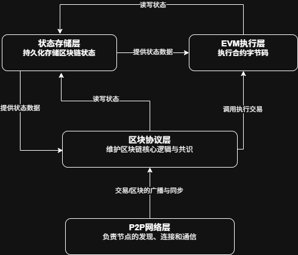

## 1.绘制分层架构图（需包含以下层级）：

[P2P 网络层]->[区块链协议层]->[状态存储层]->[EVM 执行层]

## 2.说明各层关键模块

- les（轻节点协议）

LES（Light Ethereum Subprotocol）是一种网络协议，允许轻节点与全节点进行通讯，以获取区块链数据而不需要自己存储整个区块链数据。

- trie（默克尔树实现）

在以太坊中，默克尔树（Merkle Tree）通过改良的默克尔-帕特里夏树（Merkle Patricia Trie，MPT）实现，用于高效、安全地存储和验证账户状态、交易及收据等数据。MPT 结合了默克尔树和前缀树的特性，将每个节点的哈希值作为其唯一标识，形成树状结构，使得任何数据的修改都会导致根哈希值变化，从而确保数据不可篡改，同时支持轻节点通过默克尔证明快速验证特定数据的存在性。

- core/types（区块数据结构）

在以太坊中，`core/types` 包定义了区块链的核心数据结构，主要包括**区块（Block）**、**区块头（Header）**、**交易（Transaction）**和**交易收据（Receipt）**等类型。

- **区块（Block）**：由区块头（包含父哈希、时间戳、状态根等元数据）和交易列表组成，是链式存储的基本单元；
- **交易（Transaction）**：封装了发送者、接收者、数值、Gas 等数据，用于触发状态变更；
- **交易收据（Receipt）**：记录交易执行结果（如日志、消耗的 Gas、状态是否成功等）。

这些结构通过哈希（如交易根、收据根）在区块头中相互关联，确保数据不可篡改，并支持轻客户端验证。
